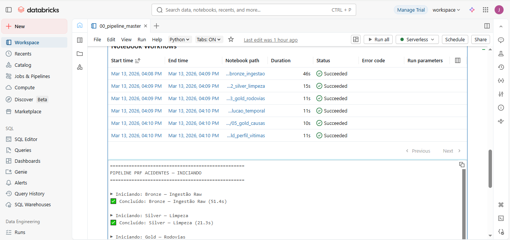
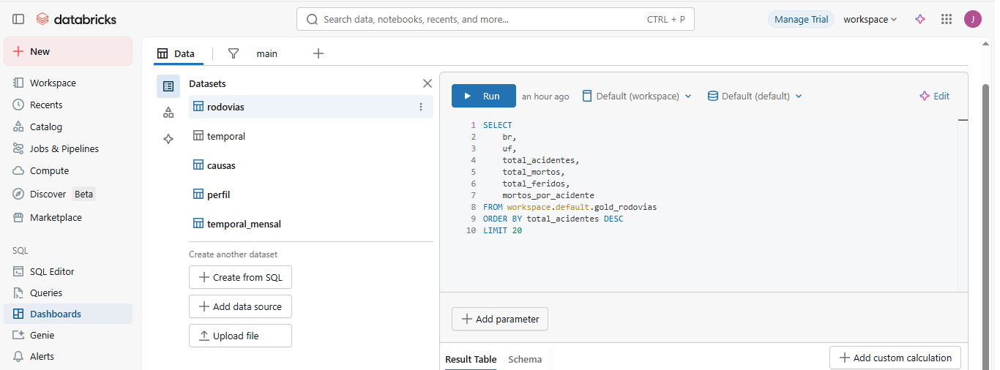
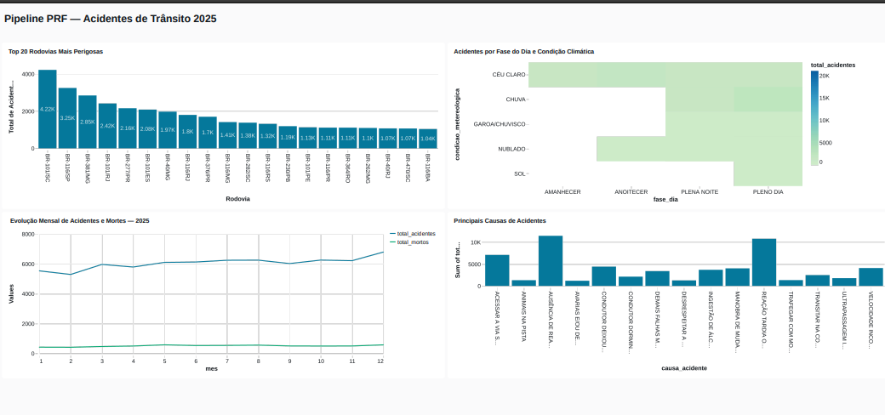

# Pipeline Medalhão — Acidentes de Trânsito PRF 2025


Pipeline de dados ponta a ponta com arquitetura **Medalhão (Bronze → Silver → Gold)** construído no **Databricks Free Edition**, processando dados públicos de acidentes de trânsito da Polícia Rodoviária Federal (PRF) de 2025.

**72.524 registros processados · 4 tabelas analíticas · 1 dashboard publicado**

> 📊 [Acessar Dashboard](https://dbc-46d8a1ec-83c5.cloud.databricks.com/dashboardsv3/01f11f07a7e913d29e7c6d5e5905133b/published?o=7474652625952199) *(requer conta Databricks)* · [Ver PDF](docs/dashboard.pdf)

---

## Por que este projeto?

Dados de acidentes de trânsito são públicos, volumosos, sujos e ricos em padrões — o cenário ideal para demonstrar engenharia de dados aplicada. O objetivo foi construir um pipeline que um time de dados de verdade colocaria em produção: ingestão confiável, transformações documentadas, camadas com responsabilidades claras e entrega analítica consumível.

A fonte escolhida foram os [dados abertos da PRF](https://www.gov.br/prf/pt-br/acesso-a-informacao/dados-abertos/dados-abertos-da-prf) — CSVs disponibilizados por ano, com encoding `latin1`, separador `;`, e inconsistências reais de schema que exigiram decisões de engenharia na camada Silver.

---

## Arquitetura: por que Medalhão?

A arquitetura Medalhão separa responsabilidades em três camadas com contratos bem definidos. Cada camada responde a uma pergunta diferente:

| Camada | Pergunta | Responsabilidade |
|--------|----------|-----------------|
| Bronze | *O dado chegou?* | Preservar o dado cru com rastreabilidade |
| Silver | *O dado está correto?* | Limpar, padronizar e enriquecer |
| Gold | *O dado responde ao negócio?* | Agregar para consumo analítico |

Essa separação evita o problema mais comum em pipelines simples: misturar ingestão com transformação. Se algo der errado na limpeza, o dado cru continua íntegro na Bronze para reprocessamento sem precisar buscar a fonte novamente.

```
Fonte (CSV PRF)
      │
      ▼
┌─────────────────────────────────────────────┐
│  BRONZE  ·  raw  ·  Delta Lake  ·  72.524   │
└──────────────────────┬──────────────────────┘
                       │
                       ▼
┌─────────────────────────────────────────────┐
│  SILVER  ·  limpo  ·  particionado por mês  │
└──────────────────────┬──────────────────────┘
                       │
          ┌────────────┼────────────┬────────────────┐
          ▼            ▼            ▼                ▼
      rodovias    temporal       causas        perfil_vitimas
                                   │
                                   ▼
                          Dashboard Databricks SQL
```

---

## Estrutura do Repositório

```
prf-acidentes-pipeline/
├── notebooks/
│   ├── 00_pipeline_master.py         # Orquestrador principal
│   ├── 01_bronze_ingestao.py         # Ingestão raw → Delta Lake
│   ├── 02_silver_limpeza.py          # Limpeza e padronização PySpark
│   ├── 03_gold_rodovias.py           # Agregação por rodovia/UF
│   ├── 04_gold_evolucao_temporal.py  # Série temporal mensal
│   ├── 05_gold_causas.py             # Ranking de causas
│   └── 06_gold_perfil_vitimas.py     # Perfil por fase do dia e clima
├── docs/
│   ├── Orquestracao.png
│   ├── SQL.png
│   ├── Dashboard.png
│   └── dashboard.pdf
├── data/sample/
│   └── amostra_100linhas.csv
└── README.md
```

---

## Bronze — Preservar antes de transformar

A camada Bronze tem uma regra que não pode ser quebrada: **nenhuma transformação no dado**. O objetivo é única e exclusivamente garantir que o dado chegou, foi persistido de forma confiável e pode ser rastreado.

O CSV da PRF tem dois detalhes que precisam ser respeitados já na leitura: encoding `latin1` (caracteres especiais do português) e separador `;` em vez da vírgula padrão. Ignorar isso na ingestão corrompe silenciosamente colunas como `causa_acidente` e `municipio`.

```python
df_raw = (spark.read
    .option("header", "true")
    .option("sep", ";")
    .option("encoding", "latin1")
    .option("inferSchema", "true")
    .csv("/Volumes/workspace/default/prf_acidentes/datatran2025.csv")
)
```

A escrita usa **Delta Lake** com particionamento por `ano_particao`. Delta Lake foi escolhido em vez de Parquet puro por três razões: suporte a transações ACID (evita leituras parciais durante escrita), capacidade de reprocessamento com `OVERWRITE` sem corromper dados existentes, e histórico de versões nativo — se precisar auditar o que estava na tabela semana passada, o Delta mantém esse registro.

**Resultado: 72.524 registros · 1 arquivo Delta · ~2MB**

---

## Silver — Onde mora o trabalho real de engenharia

A Silver é a camada mais trabalhosa e a mais importante. É aqui que os dados deixam de ser "o que veio da fonte" e passam a ser "o que o time pode confiar". Seis categorias de transformação foram aplicadas:

**1. Cast de tipos corretos**

O `inferSchema` do Spark resolve bem tipos numéricos simples, mas falha em campos que misturam formatos. A coluna `km` usa vírgula como separador decimal (`123,4`) — incompatível com `DoubleType`. A solução foi substituir antes do cast:

```python
.withColumn("km", regexp_replace(col("km"), ",", ".").cast("double"))
.withColumn("latitude", regexp_replace(col("latitude"), ",", ".").cast("double"))
```

**2. Enriquecimento temporal**

A coluna `data_inversa` contém a data completa, mas análises por mês e dia da semana exigem extração explícita. Criar essas colunas na Silver evita repetir a lógica em cada query Gold:

```python
.withColumn("ano", year(col("data")))
.withColumn("mes", month(col("data")))
.withColumn("dia_semana_num", dayofweek(col("data")))
```

**3. Padronização de texto**

Dados de formulário têm inconsistências inevitáveis: `"São Paulo"`, `"SÃO PAULO"` e `"são paulo"` são tratados como valores distintos em um `GROUP BY`. A padronização com `upper()` + `trim()` foi aplicada em todas as colunas categóricas.

**4. Tratamento de nulos**

Apenas 38 nulos foram encontrados em colunas operacionais (`uop`, `delegacia`) — irrelevantes para análise. A coluna `classificacao_acidente` tinha 1 nulo, substituído por `"NAO INFORMADO"` para não perder o registro na agregação.

**5. Particionamento por ano e mês**

A Silver é particionada por `ano` e `mes`. Em um cenário com múltiplos anos de dados, isso garante que uma query filtrando apenas `mes = 12` não varre a tabela inteira — o Spark lê apenas as partições relevantes.

---

## Gold — Quatro perguntas, quatro tabelas

Cada tabela Gold responde a uma pergunta de negócio específica. A decisão de criar tabelas separadas em vez de uma tabela única foi intencional: evita joins desnecessários nas queries do dashboard e deixa o contrato de dados explícito para quem consome.

| Tabela | Pergunta de negócio | Granularidade |
|--------|-------------------|--------------|
| `gold_rodovias` | Onde os acidentes acontecem? | BR + UF |
| `gold_evolucao_temporal` | Quando os acidentes acontecem? | Mês + dia da semana |
| `gold_causas` | Por que os acidentes acontecem? | Causa |
| `gold_perfil_vitimas` | Em que condições os acidentes acontecem? | Fase do dia + clima |

Todas as tabelas Gold incluem métricas derivadas calculadas no momento da agregação — como `mortos_por_acidente` e `letalidade` — evitando que cada consumidor recalcule essas métricas de forma inconsistente.

---

## Orquestração



O pipeline é orquestrado pelo notebook `00_pipeline_master.py` via `dbutils.notebook.run()`, que executa cada etapa em sequência com tratamento de erro e log de tempo por etapa. O **Notebook Workflows** do Databricks registra automaticamente cada execução com timestamp, duração e status — visível na imagem acima.

O print mostra a última execução completa: Bronze em 46s (leitura do CSV e escrita Delta), Silver em 15s (todas as transformações PySpark), e as quatro tabelas Gold entre 10s e 11s cada. **Tempo total: ~137 segundos.**

Em produção, cada etapa seria uma task independente em um DAG Apache Airflow, permitindo paralelismo nas tasks Gold, retry automático por etapa e alertas configuráveis. A estrutura do código já foi pensada para facilitar essa migração — cada notebook é autocontido e não depende de variáveis de sessão de outro.

---

## Camada de Consumo — SQL e Dashboard



As tabelas Gold são consumidas via **Databricks SQL**, onde cinco datasets foram criados com queries específicas para cada visualização. A camada SQL atua como a última linha de defesa de qualidade: as queries aplicam ordenações, limites e filtros que tornam os dados diretamente consumíveis pelo dashboard sem transformações adicionais. O print acima mostra os cinco datasets configurados — `rodovias`, `temporal`, `causas`, `perfil` e `temporal_mensal` — com suas queries correspondentes.

---

## Dashboard e Insights



> 📊 [Acessar Dashboard interativo](https://dbc-46d8a1ec-83c5.cloud.databricks.com/dashboardsv3/01f11f07a7e913d29e7c6d5e5905133b/published?o=7474652625952199)

### Top 20 Rodovias Mais Perigosas
A **BR-101/SC** lidera com 4.222 acidentes — mais de 1.000 a mais que a segunda colocada (BR-116/SP com 3.249). Volume, porém, não é sinônimo de letalidade: a **BR-116/BA** tem índice de `0,121` mortos por acidente, muito acima da BR-101/SC (`0,035`). Rodovias com alto volume e alta letalidade simultaneamente representam o maior risco sistêmico — e esse cruzamento só é possível porque a Gold calcula os dois índices separadamente.

### Evolução Mensal — Sazonalidade Clara
O gráfico de linha revela uma sazonalidade consistente: **janeiro e fevereiro** registram os menores volumes (5.528 e 5.287 acidentes respectivamente), enquanto **dezembro** explode para 6.787 — o pico do ano. A segunda linha, de mortos, acompanha proporcionalmente mas com variações próprias: **maio** apresenta a maior taxa de mortalidade mensal (574 mortos), sugerindo que o volume por si só não explica a gravidade.

### Principais Causas — Frequência vs. Letalidade
O dado mais revelador do projeto. **"Ausência de reação do condutor"** é a causa mais frequente (15,81% dos acidentes), mas **"Transitar na contramão"** é a mais letal — com índice de `0,39`, mata em quase 1 a cada 3 acidentes em que ocorre. **"Velocidade incompatível"** (5,64% dos casos, letalidade `0,115`) e **"Condutor dormindo"** (2,92%, letalidade `0,081`) completam o grupo de causas com alta gravidade relativa. Essa separação entre frequência e letalidade é o insight que diferencia análise de negócio de simples contagem de registros.

### Heatmap Fase do Dia × Condição Climática
O resultado contra-intuitivo mais interessante do dataset: **pleno dia com céu claro** é a combinação com maior volume absoluto de acidentes. A hipótese mais provável é que essa combinação representa simpleslement o maior volume de tráfego — mais veículos em circulação em boas condições gera mais acidentes em termos absolutos. Em termos relativos (acidentes por volume de tráfego), condições adversas continuam sendo mais perigosas, mas esse dado não está disponível na fonte da PRF.

---

## Stack Tecnológica

| Componente | Tecnologia | Decisão |
|-----------|-----------|---------|
| Processamento | PySpark 3.x | Transformações distribuídas em DataFrames nativos |
| Armazenamento | Delta Lake | ACID, versionamento, reprocessamento seguro |
| Plataforma | Databricks Free Edition | Cluster serverless gerenciado, sem custo |
| Orquestração | `dbutils.notebook.run()` | Simula DAG Airflow sem infraestrutura adicional |
| Visualização | Databricks SQL Dashboard | Consumo direto das tabelas Gold |
| Versionamento | Git / GitHub | — |

---

## Como Reproduzir

**Pré-requisitos:** conta no [Databricks Free Edition](https://www.databricks.com/try-databricks) · dados da PRF em [dados.prf.gov.br](https://www.gov.br/prf/pt-br/acesso-a-informacao/dados-abertos/dados-abertos-da-prf)

```bash
git clone https://github.com/joaohppenha/prf-acidentes-pipeline
```

1. Suba o CSV no Unity Catalog Volume: `Catalog > workspace > default > prf_acidentes`
2. Importe os notebooks para o seu workspace Databricks
3. Execute `notebooks/00_pipeline_master.py`

Tempo estimado: **~2 minutos**.

---

## Próximos Passos

- [ ] Adicionar dados de 2020–2024 para análise de tendências plurianuais
- [ ] Migrar orquestração para **Apache Airflow** com DAG de tasks independentes
- [ ] Deploy em cloud com **AWS MWAA** ou **GCP Cloud Composer**
- [ ] Testes de qualidade de dados com **Great Expectations**
- [ ] Implementar **Data Catalog** completo com Unity Catalog

---

## Fonte dos Dados

Dados públicos da **Polícia Rodoviária Federal (PRF)** disponibilizados em [dados.prf.gov.br](https://www.gov.br/prf/pt-br/acesso-a-informacao/dados-abertos/dados-abertos-da-prf) sob licença de dados abertos do governo federal brasileiro.

---

**João Henrique Penha** · [](https://github.com/joaohppenha)
